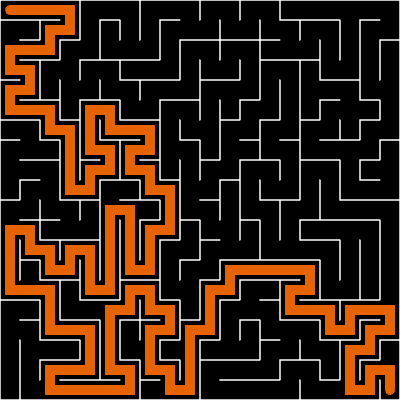

# Algernon.js

Algernon is a JS library for efficiently generating, solving, and rendering 2D mazes.

[_Where does the name come from?_](https://en.wikipedia.org/wiki/Flowers_for_Algernon)

Found an issue or a performance improvement? Feel free to leave an issue or make a pull request!


_Maze generated, solved, and rendered by Algernon-js_

-   [Installation](#installation)
-   [Usage](#usage)
-   [Benchmarks](#benchmarks)

## Installation

Via NPM:

```bash
npm i algernon-js
```

Via CDN:

```html
<script
	type="module"
	src="https://cdn.jsdelivr.net/npm/algernon-js/dist/algernon.js"
></script>
```

## Usage

### Maze Generation

**Example**:

```js
import { generateMazeBacktracking } from "algernon-js"

const [rows, cols] = [20, 20]

const rawMaze = generateMazeBacktracking(rows, cols)
```

**Format:**

In `algernon-js`, mazes are stored as a 2D array of integers for a mix of space efficiency and convenience.

Each cell may have North, South, East, or West walls (the outer edges of the maze will be bounded).

Internally, bits are used to represent the presence of walls or other significant information.

That means a cell is internally used like this (`0b1001` - a cell with a North and West wall), but looks like this (`9` - the decimal representation).

If you are familiar with bit manipulation, feel free to use mazes in their "raw" format. If not, check out the conversions available for more familiar formats.

| Name         | Description                                                                                | Method                     |
| ------------ | ------------------------------------------------------------------------------------------ | -------------------------- |
| Backtracking | A fast algorithm for mazes with some long corridors. Reasonable general purpose algorithm. | `generateMazeBacktracking` |
| Kruskal's    | On the slower side, good for simple and relatively easy mazes.                             | `generateMazeKruskal`      |
| Growing Tree | Fast, performs like Prim's by default but configurable.                                    | `generateMazeGrowingTree`  |

_Some of these algorithms are additionally configurable. Check out the JSDoc comments for more info._

### Maze Solving

**Example:**

```js
// maze already generated, stored as `rawMaze`

import { solveAStar } from "algernon-js"

// Solve the maze using A*, starting at the top left
// and ending at the bottom right
const solution = solveAStar(rawMaze, [0, 0], [rows - 1, cols - 1])
```

**Format:**

Solutions are simply arrays, with each element as an index in the original `rawMaze`.

For example: `[[0,0],[1,0],[1,1],[1,2],...]`

| Name         | Description                                                                                                | Method       |
| ------------ | ---------------------------------------------------------------------------------------------------------- | ------------ |
| A\* (A Star) | Fast Dijkstra's-based solver that uses heuristics. Reasonable general purpose solver.                      | `solveAStar` |
| ACO          | Ant Colony Optimization is not recommended for real-world purposes. It is interesting for experimentation. | `solveACO`   |

_Many of these algorithms use heuristics or additional configuration. Check of the JSDoc comments for more info._

### Rendering

This is intended as a simple solution for basic web apps or testing. Feel free to use the code as a starting point for a custom solution.

**Example:**

```html
<!-- index.html -->

<canvas id="demo-canvas" width="400" height="400"></canvas>
```

```js
// script.js

import {
	generateMazeBacktracking,
	solveAStar,
	renderMazeToCanvas,
} from "algernon-js"

const [rows, cols] = [20, 20]

// Generate and solve the maze
const rawMaze = generateMazeBacktracking(rows, cols)
const solution = solveAStar(rawMaze, [0, 0], [rows - 1, cols - 1])

// Render the maze
const canvas = document.getElementById("demo-canvas")
const ctx = canvas.getContext("2d")

// Render each cell at 20 pixels x 20 pixels
// `solution` is an optional argument
renderMazeToCanvas(ctx, 20, rawMaze, solution)
```

### Conversion

**Raw <-> Node Matrix**

```js
// `rawMaze` already generated

const nodeMatrix = convertRawToNodeMatrix(rawMaze)

// A node matrix is a 2D array of `MatrixNode`,
// where each node contains the following booleans:
// hasNorthWall, hasSouthWall, hasEastWall, hasWestWall

// Convert node matrix back to raw
const updatedRaw = convertNodeMatrixToRaw(nodeMatrix)
```

**Raw -> Node Graph**

```js
// `rawMaze` already generated

// Generate a node graph with the given start and end points
const nodeGraph = convertRawToNodeGraph(rawMaze, [0, 0], [row - 1, col - 1])

// A node graph is a graph of `GraphNode`,
// where each node contains the following booleans:
// isStart, isEnd, hasNorthWall, hasSouthWall, hasEastWall, hasWestWall
// and the following references (or null if not present):
// northNeighbor, southNeighbor, eastNeighbor, westNeighbor
```

**Raw <-> ArrayBuffer (Binary)**

```js
// `rawMaze` already generated

// Convert the maze to a Uint8Array,
// with the first byte storing the rows and cols
const buffer = serializeRawToBinary(rawMaze)

const deserialized = deserializeBinaryToRaw(buffer)
```

**Raw <-> Base64 String**

```js
// `rawMaze` already generated

// Convert the maze to a Base64 string
const base64 = serializeRawToString(rawMaze)

const deserialized = deserializeStringToRaw(base64)
```

### Helpers

Internally used helper methods, like `removeWall`, `getAvailableNeighbors`, `getDirection`, and more, are made available through the `helpers` namespace.

**Example:**

```js
import { helpers } from "algernon-js"

const c1 = [0, 0]
const c2 = [1, 0]

const directionBetweenCells = helpers.getDirection(c1, c2)
// directionBetweenCells: 0b0100 or South
```

## Benchmarks

Benchmark development is in progress right now.
